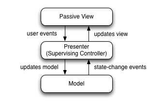

UniRx - Reactive Extensions for Unity
===
Created by Yoshifumi Kawai(neuecc)

What is UniRx?
---
UniRx(Reactive Extensions for Unity) is re-implementation of .NET Reactive Extensions. Official Rx is great but can't work on Unity and has some issue of iOS AOT. This library remove there issues and add some specified utility for Unity. Supported platforms are PC/Mac/Android/iOS/WP8/WindowsStore/etc and fully supported Unity 5(and 4.6).   

UniRx is available in Unity Asset Store(FREE) - http://u3d.as/content/neuecc/uni-rx-reactive-extensions-for-unity/7tT

Presentation - http://www.slideshare.net/neuecc/unirx-reactive-extensions-for-unityen

Unity Forums support thread, ask me any questions - http://forum.unity3d.com/threads/248535-UniRx-Reactive-Extensions-for-Unity

Release Notes, see [UniRx/releases](https://github.com/neuecc/UniRx/releases)

Why Rx?
---
Ordinary, Unity Network operation use `WWW` and `Coroutine` but `Coroutine` is not good practice for asynchronous operation.

Let me show some example.

1. Coroutine can't return result value. (because return type should be IEnumerator)
2. It also won't handle exception. (because yield return can't surrond with try-catch)
These lack of composability cause Operation close-coupled, and we have to write huge monolithic IEnumerator.

Rx curing asynchronous blues like that. Rx is a library to compose asynchronous and event-based programs using observable collections and LINQ-style query operators. 
  
GameLoop(every Update, OnCollisionEnter, etc), Sensor(like Kinect, Leap Motion, etc) is all of event. Rx considere event as reactive sequence which is possible to compose and perform time-based operations easily by using many LINQ query operators.

Unity is single thread but UniRx helps multithreading for join, cancel, access GameObject etc.

UniRx helps UI programming for uGUI. All UI events(clicked, valuechanged, etc) can convert event streams by UniRx. 
        

The Introduction
---
Great introduction article of Rx - [The introduction to Reactive Programming you've been missing](https://gist.github.com/staltz/868e7e9bc2a7b8c1f754). Following code is same sample of detect double click.

```
var clickStream = Observable.EveryUpdate()
    .Where(_ => Input.GetMouseButtonDown(0));

clickStream.Buffer(clickStream.Throttle(TimeSpan.FromMilliseconds(250)))
    .Where(xs => xs.Count >= 2)
    .Subscribe(xs => Debug.Log("DoubleClick Detected! Count:" + xs.Count));
```

This example includes the following contents(In only five lines!).

* Game loop(Update) as event stream
* Event stream is composable
* Merging self stream
* Easily handle time based operation   

How to Use for WWW
---
async operation, use ObservableWWW, it's Get/Post returns IObservable.

```csharp
ObservableWWW.Get("http://google.co.jp/")
    .Subscribe(
        x => Debug.Log(x.Substring(0, 100)), // onSuccess
        ex => Debug.LogException(ex)); // onError
```

Rx is composable, cancelable and can query with LINQ query expressions.

```csharp
// composing asynchronous sequence with LINQ query expressions
var query = from google in ObservableWWW.Get("http://google.com/")
            from bing in ObservableWWW.Get("http://bing.com/")
            from unknown in ObservableWWW.Get(google + bing)
            select new { google, bing, unknown };

var cancel = query.Subscribe(x => Debug.Log(x));

// Call Dispose is cancel.
cancel.Dispose();
```

Parallel request use Observable.WhenAll
```csharp
// Observable.WhenAll is for parallel asynchronous operation
// (It's like Observable.Zip but specialized for single async operations like Task.WhenAll)
var parallel = Observable.WhenAll(
    ObservableWWW.Get("http://google.com/"),
    ObservableWWW.Get("http://bing.com/"),
    ObservableWWW.Get("http://unity3d.com/"));

parallel.Subscribe(xs =>
{
    Debug.Log(xs[0].Substring(0, 100)); // google
    Debug.Log(xs[1].Substring(0, 100)); // bing
    Debug.Log(xs[2].Substring(0, 100)); // unity
});
```

with progress
```csharp
// notifier for progress
var progressNotifier = new ScheduledNotifier<float>();
progressNotifier.Subscribe(x => Debug.Log(x)); // write www.progress

// pass notifier to WWW.Get/Post
ObservableWWW.Get("http://google.com/", progress: progressNotifier).Subscribe();
```

Error Handling
```csharp
// If WWW has .error, ObservableWWW throws WWWErrorException to onError pipeline.
// WWWErrorException has RawErrorMessage, HasResponse, StatusCode, ResponseHeaders
ObservableWWW.Get("http://www.google.com/404")
    .CatchIgnore((WWWErrorException ex) =>
    {
        Debug.Log(ex.RawErrorMessage);
        if (ex.HasResponse)
        {
            Debug.Log(ex.StatusCode);
        }
        foreach (var item in ex.ResponseHeaders)
        {
            Debug.Log(item.Key + ":" + item.Value);
        }
    })
    .Subscribe();
```

How to Use for IEnumerator(as Coroutine)
---
IEnumerator(Coroutine) is Unity's primitive asynchronous tool. UniRx integrates coroutine and IObservable. Write async in coroutine, Orchestrate many coroutines by UniRx is best way for control asynchronous flow.

```csharp
// two coroutines

IEnumerator AsyncA()
{
    Debug.Log("a start");
    yield return new WaitForSeconds(1);
    Debug.Log("a end");
}

IEnumerator AsyncB()
{
    Debug.Log("b start");
    yield return new WaitForEndOfFrame();
    Debug.Log("b end");
}

// main code
// Observable.FromCoroutine convert IEnumerator to Observable<Unit>.
// other shorthand, AsyncA().ToObservable()
        
// after completed AsyncA, run AsyncB as continuous routine.
// UniRx expands SelectMany(IEnumerator) as SelectMany(IEnumerator.ToObservable())
var cancel = Observable.FromCoroutine(AsyncA)
    .SelectMany(_ => AsyncB())
    .Subscribe();

// you can stop coroutine use subscription's Dispose.
cancel.Dispose();
```

If you needs coroutine with return value, normally we use callback. Observable.FromCoroutine supports convert coroutine to IObservable[T] with cancellation.

```csharp
// public method
public static IObservable<string> GetWWW(string url)
{
    // convert coroutine to IObservable
    return Observable.FromCoroutine<string>((observer, cancellationToken) => GetWWWCore(url, observer, cancellationToken));
}

// IObserver is callback publisher
// note: Principles of IObserver is "OnNext* (OnError | Oncompleted)?" 
static IEnumerator GetWWWCore(string url, IObserver<string> observer, CancellationToken cancellationToken)
{
    var www = new UnityEngine.WWW(url);
    while (!www.isDone && !cancellationToken.IsCancellationRequested)
    {
        yield return null;
    }

    if (cancellationToken.IsCancellationRequested) yield break;

    if (www.error != null)
    {
        observer.OnError(new Exception(www.error));
    }
    else
    {
        observer.OnNext(www.text);
        observer.OnCompleted(); // IObserver needs OnCompleted after OnNext!
    }
}
```

more application examples, following is multiple OnNext pattern.

```csharp
public static IObservable<float> ToObservable(this UnityEngine.AsyncOperation asyncOperation)
{
    if (asyncOperation == null) throw new ArgumentNullException("asyncOperation");

    return Observable.FromCoroutine<float>((observer, cancellationToken) => RunAsyncOperation(asyncOperation, observer, cancellationToken));
}

static IEnumerator RunAsyncOperation(UnityEngine.AsyncOperation asyncOperation, IObserver<float> observer, CancellationToken cancellationToken)
{
    while (!asyncOperation.isDone && !cancellationToken.IsCancellationRequested)
    {
        observer.OnNext(asyncOperation.progress);
        yield return null;
    }
    if (!cancellationToken.IsCancellationRequested)
    {
        observer.OnNext(asyncOperation.progress); // push 100%
        observer.OnCompleted();
    }
}

// usecase
Application.LoadLevelAsync("testscene")
    .ToObservable()
    .Do(x => Debug.Log(x)) // output progress
    .Last() // last sequence is load completed
    .Subscribe();
```

How to Use for MultiThreading
---

```csharp
// Observable.Start is start factory methods on specified scheduler
// default is on ThreadPool
var heavyMethod = Observable.Start(() =>
{
    // heavy method...
    System.Threading.Thread.Sleep(TimeSpan.FromSeconds(1));
    return 10;
});

var heavyMethod2 = Observable.Start(() =>
{
    // heavy method...
    System.Threading.Thread.Sleep(TimeSpan.FromSeconds(3));
    return 10;
});

// Join and await two other thread values
Observable.WhenAll(heavyMethod, heavyMethod2)
    .ObserveOnMainThread() // return to main thread
    .Subscribe(xs =>
    {
        // Unity can't touch GameObject from other thread
        // but use ObserveOnMainThread, you can touch GameObject naturally.
        (GameObject.Find("myGuiText")).guiText.text = xs[0] + ":" + xs[1];
    }); 
```

DefaultScheduler
---
UniRx's default time based operation(Interval, Timer, Buffer(timeSpan), etc...)'s Scheduler is `Scheduler.MainThread`.It means most operator(excpet `Observable.Start`) is work on single-thread, you don't need ObserverOn and you don't mind thread safety. It's differece with RxNet but better fit to Unity environment.  

`Scheduler.MainThread` under Time.timeScale's influence.If you want to ignore, use ` Scheduler.MainThreadIgnoreTimeScale`.


How to Use for MonoBehaviour
---
UniRx has two extended MonoBehaviour. TypedMonoBehaviour is typesafe MonoBehaviour.

```csharp
public class Test : TypedMonoBehaviour
{
    // all message is overridable, it's typesafe
    public override void Update()
    {
        base.Update();
    }

    // use Coroutine, use "new" keyword
    new public IEnumerator Start()
    {
        while (true)
        {
            yield return null;
        }
    }
}
```

ObservableMonoBehaviour is extended TypedMonoBehaviour. All message is Observable.

```csharp
public class Test : ObservableMonoBehaviour
{
    public override void Start()
    {
        // All events can subscribe by ***AsObservable
        this.OnMouseDownAsObservable()
            .SelectMany(_ => this.UpdateAsObservable())
            .TakeUntil(this.OnMouseUpAsObservable())
            .Select(_ => Input.mousePosition)
            .Repeat()
            .Subscribe(x => Debug.Log(x));

        // If you use ObservableMonoBehaviour, must call base method
        base.Start();
    }
}
```

> Note:
> TypedMonoBehaviour and ObservableMonoBehaviour cause some performance down.
> I don't recommend instantiate many Typed/ObservableMonoBehaviour.
> If you want to observe MonoBehaviour's event, copy from ObservableMonoBehaviour and paste to your simple MonoBehaviour.
> for example

```
public class ObservableDestoryMonoBehaviour : MonoBehaviour
{
    Subject<Unit> onDestroy;

    /// <summary>This function is called when the MonoBehaviour will be destroyed.</summary>
    public virtual void OnDestroy()
    {
        if (onDestroy != null) onDestroy.OnNext(Unit.Default);
    }

    /// <summary>This function is called when the MonoBehaviour will be destroyed.</summary>
    public IObservable<Unit> OnDestroyAsObservable()
    {
        return onDestroy ?? (onDestroy = new Subject<Unit>());
    }
}
```

Convert Unity callback to IObservable
---
Use Subject(or AsyncSubject for async operation). For example...

```csharp
public class LogCallback
{
    public string Condition;
    public string StackTrace;
    public UnityEngine.LogType LogType;
}

public static class LogHelper
{
    static Subject<LogCallback> subject;

    public static IObservable<LogCallback> LogCallbackAsObservable()
    {
        if (subject == null)
        {
            subject = new Subject<LogCallback>();

            // Publish to Subject in callback
            UnityEngine.Application.RegisterLogCallback((condition, stackTrace, type) =>
            {
                subject.OnNext(new LogCallback { Condition = condition, StackTrace = stackTrace, LogType = type });
            });
        }

        return subject.AsObservable();
    }
}

// method is separatable and composable
LogHelper.LogCallbackAsObservable()
    .Where(x => x.LogType == LogType.Warning)
    .Subscribe();

LogHelper.LogCallbackAsObservable()
    .Where(x => x.LogType == LogType.Error)
    .Subscribe();
```
In Unity5, `Application.RegisterLogCallback` is removed to `Application.logMessageReceived`. We can simply replace by `Observable.FromEvent`.

```csharp
public static IObservable<LogCallback> LogCallbackAsObservable()
{
    return Observable.FromEvent<Application.LogCallback, LogCallback>(
        h => (condition, stackTrace, type) => h(new LogCallback { Condition = condition, StackTrace = stackTrace, LogType = type }),
        h => Application.logMessageReceived += h, h => Application.logMessageReceived -= h);
}
```

Stream Logger
---
```csharp
// using UniRx.Diagnostics;

// logger is threadsafe, define per class with name.
static readonly Logger logger = new Logger("Sample11");

// call once at applicationinit
public static void ApplicationInitialize()
{
    // Log as Stream, UniRx.Diagnostics.ObservableLogger.Listener is IObservable<LogEntry>
    // You can subscribe and output to any place.
    ObservableLogger.Listener.LogToUnityDebug();

    // for example, filter only Exception and upload to web.
    // (make custom sink(IObserver<EventEntry>) is better to use)
    ObservableLogger.Listener
        .Where(x => x.LogType == LogType.Exception)
        .Subscribe(x =>
        {
            // ObservableWWW.Post("", null).Subscribe();
        });
}

// Debug is write only DebugBuild.
logger.Debug("Debug Message");

// or other logging methods
logger.Log("Message");
logger.Exception(new Exception("test exception"));
```

Unity specified extra gems
---
```csharp
// Unity's singleton UiThread Queue Scheduler
Scheduler.MainThreadScheduler 
ObserveOnMainThread()/SubscribeOnMainThread()

// Global StartCoroutine runner
MainThreadDispatcher.StartCoroutine(enumerator)

// convert Coroutine to IObservable
Observable.FromCoroutine((observer, token) => enumerator(observer, token)); 

// convert IObservable to Coroutine
yield return Observable.Range(1, 10).StartAsCoroutine();

// Lifetime hooks
Observable.EveryApplicationPause();
Observable.EveryApplicationFocus();
Observable.OnceApplicationQuit();
```

Frame count based time operators
---
UniRx has some frame count based time operators.

Method | 
-------|
EveryUpdate|
EveryFixedUpdate|
EveryEndOfFrame|
NextFrame|
IntervalFrame|
TimerFrame|
DelayFrame|
SampleFrame|
ThrottleFrame|
TimeoutFrame|
DelayFrameSubscription|

For example, delayed invoke once

```csharp
Observable.TimerFrame(100).Subscribe(_ => Debug.Log("after 100 frame"));
```

uGUI Integration
---
UniRx can handle `UnityEvent` easily. You can use `UnityEvent.AsObservable` for register events.

```csharp
public Button MyButton;
// ---
MyButton.onClick.AsObservable().Subscribe(_ => Debug.Log("clicked"));
```

Event as Observable, it enables declaretive ui programming. 

```csharp
public Toggle MyToggle;
public InputField MyInput;
public Text MyText;
public Slider MySlider;

// On Start, you can write reactive rule for declaretive/reactive ui programming
void Start()
{
    // Toggle, Input etc as Observable(OnValueChangedAsObservable is helper for provide isOn value on subscribe)
    // SubscribeToInteractable is UniRx.UI Extension Method, same as .interactable = x)
    MyToggle.OnValueChangedAsObservable().SubscribeToInteractable(MyButton);
    
    // input shows delay after 1 second
    MyInput.OnValueChangeAsObservable()
        .Skip(1) // ignore initial text(blank)
        .Delay(TimeSpan.FromSeconds(1))
        .SubscribeToText(MyText); // SubscribeToText is UniRx.UI Extension Method
    
    // converting for human visibility
    MySlider.OnValueChangedAsObservable()
        .SubscribeToText(MyText, x => Math.Round(x, 2).ToString());
}
````

If you interested in reactive ui programming, you can see Sample12, Sample13 and below ReactiveProperty section. 

ReactiveProperty, ReactiveCollection
---
Game's data needs notification. Do you use property and event(callback)? It's too complex. UniRx provides ReactiveProperty which is lightweight property broker.

```csharp
// Reactive Notification Model
public class Enemy
{
    public ReactiveProperty<long> CurrentHp { get; private set; }

    public ReactiveProperty<bool> IsDead { get; private set; }

    public Enemy(int initialHp)
    {
        // Declarative Property
        CurrentHp = new ReactiveProperty<long>(initialHp);
        IsDead = CurrentHp.Select(x => x <= 0).ToReactiveProperty();
    }
}

// ---
// onclick, HP decrement
MyButton.OnClickAsObservable().Subscribe(_ => enemy.CurrentHp.Value -= 99);
// subscribe from notification model.
enemy.CurrentHp.SubscribeToText(MyText);
enemy.IsDead.Where(isDead => isDead == true)
    .Subscribe(_ =>
    {
        MyButton.interactable = false;
    });
```

You can combine ReactiveProperty, ReactiveCollection and UnityEvent.AsObservable. All ui elements is observable.

Generic ReactiveProeprty is not inspecatble but UniRx provides specialized ReactiveProperty for use in inspector. You can use Int/LongReactiveProperty, Float/DoubleReactiveProperty, StringReactiveProperty, etc for show and editable in inspector. If you want to use Enum's ReactiveProperty, you can make custom ReactiveProperty[T] for inspecatable.

`InspectorDisplayAttribute` helps readability in inspector. 


```csharp
[InspectorDisplay]
public IntReactiveProperty IntRxProp = new IntReactiveProperty(); 
```

If value is only defined from stream, it is readonly. You can use `ReadOnlyReactiveProperty`.

```csharp
public class Person
{
    public ReactiveProperty<string> GivenName { get; private set; }
    public ReactiveProperty<string> FamilyName { get; private set; }
    public ReadOnlyReactiveProperty<string> FullName { get; private set; }

    public Person(string givenName, string familyName)
    {
        GivenName = new ReactiveProperty<string>(givenName);
        FamilyName = new ReactiveProperty<string>(familyName);
        // If change the givenName or familyName, notify with fullName!
        FullName = GivenName.CombineLatest(FamilyName, (x, y) => x + " " + y).ToReadOnlyReactiveProperty();
    }
}
```

Model-View-(Reactive)Presenter Pattern
---
UniRx makes it possible to the MVP(MVRP) Pattern.



Why MVP? not MVVM? Unity doesn't have binding mechanism and create a binding layer is too complex and loss the performance. But you need someone to update the View. Thus presenter know view component and updates view. Although there is no binding, Observable enables the notification subscription like binding. It calls reactive presenter. 

```csharp
// Presenter for scene(canvas) root.
public class ReactivePresenter : MonoBehaviour
{
    // Presenter knows View(binded from inspector)
    public Button MyButton;
    public Toggle MyToggle;
    
    // State-Change-Events from Model by ReactiveProperty
    Enemy enemy = new Enemy(1000);

    void Start()
    {
        // user events from View by Rx and notify to Model in reactive 
        MyButton.OnClickAsObservable().Subscribe(_ => enemy.CurrentHp.Value -= 99);
        MyToggle.OnValueChangedAsObservable().SubscribeToInteractable(MyButton);

        // notify from Model to Presenter by Rx and update View
        enemy.CurrentHp.SubscribeToText(MyText);
        enemy.IsDead.Where(isDead => isDead == true)
            .Subscribe(_ =>
            {
                MyToggle.interactable = MyButton.interactable = false;
            });
    }
}

// Model, all property notify value changed 
public class Enemy
{
    public ReactiveProperty<long> CurrentHp { get; private set; }

    public ReactiveProperty<bool> IsDead { get; private set; }

    public Enemy(int initialHp)
    {
        // Declarative Property
        CurrentHp = new ReactiveProperty<long>(initialHp);
        IsDead = CurrentHp.Select(x => x <= 0).ToReactiveProperty();
    }
}
```

View is Scene, Unity hierarchy. View to Presenter associates by Unity Engine on initialize. XxxAsObservable is created a Signal simply, no overhead. SubscribeToText and SubscribeToInteractable(like Command) is simple binding like helper.  There are simple tools but very powerful. It is natural for Unity and achieve maximum performance and clean architecture.

Of course you can use with other MVVM(or MV*) framework. UniRx/ReactiveProperty is only simple toolkit. 

ObservableEventTrigger
---
In `UniRx.UI` namespace have `ObservableEventTrigger`(note: other than this `UniRx` namespace has similar class  `ObservableStateMachineBehaviour`). ObservableEventTrigger is very useful for adhoc attach and observe UI events.

```csharp
var eventTrigger = this.gameObject.AddComponent<ObservableEventTrigger>();
eventTrigger.OnBeginDragAsObservable()
    .SelectMany(_ => eventTrigger.OnDragAsObservable(), (start, current) => UniRx.Tuple.Create(start, current))
    .TakeUntil(eventTrigger.OnEndDragAsObservable())
    .Repeat()
    .Subscribe(x => Debug.Log(x));
```

And If you using `UniRx.UI`, all class instance can call `ObserveEveryValueChanged` method it watch chaning value in every frame.

```csharp
using UniRx.UI;

// watch position change
this.transform.ObserveEveryValueChanged(x => x.position).Subscribe(x => Debug.Log(x));
```

Samples
---
see [UniRx/Examples](https://github.com/neuecc/UniRx/tree/master/Assets/UniRx/Examples)  
How to ResourceManagement(Sample09_EventHandling), What is MainThreadDispatcher? and other notes.

vs iOS AOT
---
UniRx has AotSafe Utilities.

```csharp
// create safety iterator
Enumerable.Range(1, 10).AsSafeEnumerable().ToArray();

// elements wrap to class
Enumerable.Range(1, 10).WrapValueToClass(); // IEnumerable<Tuple<int>>
Observable.Range(1, 10).WrapValueToClass(); // IObservable<Tuple<int>>
```

Please see [AOT Exception Patterns and Hacks](https://github.com/neuecc/UniRx/wiki/AOT-Exception-Patterns-and-Hacks).

If you encount [Ran out of trampolines of type 2](http://developer.xamarin.com/guides/ios/troubleshooting/troubleshooting/) error, set AOT Compilation Options `nimt-trampolines=2048`. If you encount Ran out of trampolines of type 0, you should set AOT Compilation Options `ntrampolines=2048` too. I recommend set both for use UniRx.

Windows Store/Phone App(NETFX_CORE) notice
---
Some interface conflicts in Windows Store App for example `UniRx.IObservable<T>` and `System.IObservable<T>`.  
Therefore we've decided in NETFX_CORE, remove `UniRx.IObservable<T>`.  
There is no problem if you are using the short name.  
If you are using the full name(`UniRx.IObservable<T>`), please replace to use the short name(`IObservable<T>`).

Reference
---
* [RxJava Wiki](https://github.com/Netflix/RxJava/wiki)
 
This wiki is recommended way for learn Rx. You can understand behavior of all operators by graphical marble diagram.

* [Reactive Game Architectures](http://sugarpillstudios.com/wp/?page_id=279)

Introduction to how to use Rx for Game.

* [Introduction to Rx](http://introtorx.com/)

Great online tutorial and eBook.

* [Rx(Reactive Extensions)](https://rx.codeplex.com/)

Original project home.

* [Beginner's Guide to the Reactive Extensions](http://msdn.microsoft.com/en-us/data/gg577611)

Many Videos and slides and documents.

* [ReactiveX Languages](http://reactivex.io/languages.html)

UniRx is official ReacitveX language family.

Help & Contribute
---
Unity Forums support thread, ask me any questions - [http://forum.unity3d.com/threads/248535-UniRx-Reactive-Extensions-for-Unity](http://forum.unity3d.com/threads/248535-UniRx-Reactive-Extensions-for-Unity)  

We welcome to your contribute such as bug report, request, and pull request.  
At first, see and please write GitHub issues.  
Source code is available in `Assets/UniRx/Scripts`.  
This project is using Visual Studio with [UnityVS](http://unityvs.com/).

Author's other Unity + LINQ Assets
---
[LINQ to GameObject](https://github.com/neuecc/LINQ-to-GameObject-for-Unity/) is GameObject extensions for Unity that allows traverse hierarchy and append GameObject like LINQ to XML. It's free and opensource on GitHub.


Author Info
---
Yoshifumi Kawai(a.k.a. neuecc) is software developer in Japan.
He is Director/CTO at Grani, Inc.
Grani is top social game developer in Japan. 
He awarded Microsoft MVP for Visual C# since 2011.
He is known by creator of [linq.js](http://linqjs.codeplex.com/)(LINQ to Objects for JavaScript)

Blog: http://neue.cc/ (JPN)  
Twitter: https://twitter.com/neuecc (JPN)

License
---
This library is under MIT License.

Some codes are borrowed from [Rx.NET](https://rx.codeplex.com/) and [mono/mcs](https://github.com/mono/mono).
